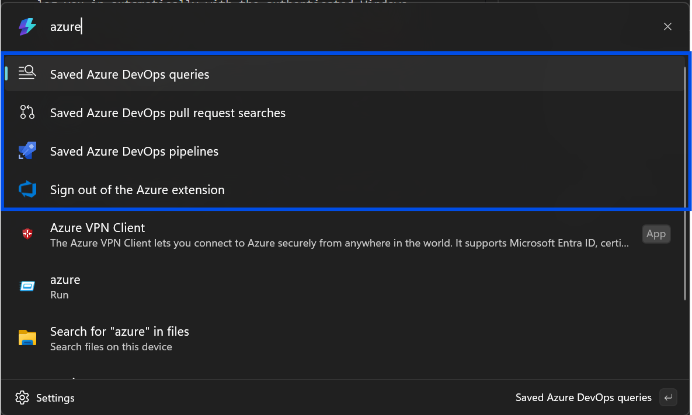
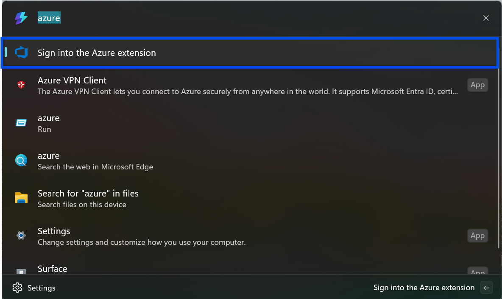
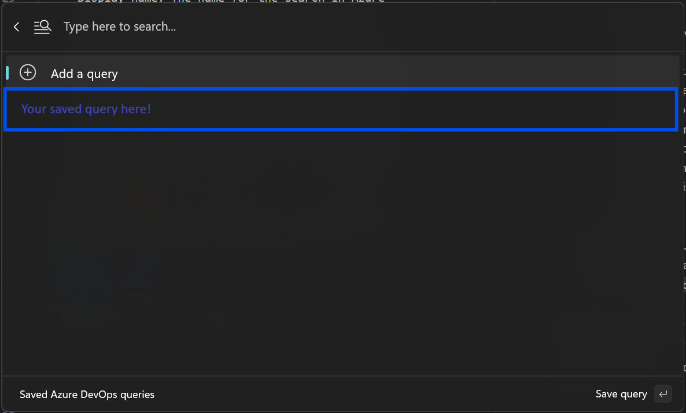

# Command Palette Azure Extension Quick Start Guide

Welcome to the Command Palette Azure Extension Quick Start Guide! Below are the instructions you'll need to use the Azure extension.

## Signing in

By default, the Command Palette Azure Extension will attempt to log you in automatically with the authenticated Windows account on the device. To determine whether the automatic sign in was successful, open Command Palette (`Windows`+`Alt`+`Space` or your custom keyboard shortcut) and search 'azure' in the search bar.

If you were signed in successfully, you'll see the below commands:

If you were not signed in automatically, you can click the "Sign in" command shown here:

To change the Azure DevOps account the extension uses, sign out of the extension and sign back into the account you'd like.
> Note: Once you sign out of an account, you may not be able to sign back in.

## Adding searches

To make your favorite queries, pull request searches, and pipelines accessible in the Command Palette, follow these steps:

* Select the type of search you want to add (query, pull requests, pipeline)
* Navigate to the Saved [Search] command, then select "Add a [Search]"
* Fill out the form in the Add page. Here's a breakdown of what may be needed:
   * URL: The URL to the search you want to save. The forms provide a sample URL to get you started
      > Note: Temporary queries are currently not supported. To save a query, use the query URL in the address bar of the browser, not the URL from the "Share query link" button in Azure DevOps
    * Display name: The name for the search in Azure DevOps. This may be useful if you have multiple "Assigned to me" queries in different projects. A default display name is listed in the form as well.
    * View (pull request searches only): The kinds of pull requests you'd like to see for the given repository.
    * Pin [Search] to the top level: Select this checkbox if you want to access the item from the top level (the same place you found the "Sign out of the Azure extension" command). If this checkbox is unselected when saving, you can find the saved search in the list under the "Saved Azure DevOps [Search]" command.
* Press Save [Search]
* You can now find your saved search by navigating back (either by clicking on the back arrow or bringing the cursor back to the search bar and pressing `Esc`)

## Viewing a search:

Once you saved a search, you can find it in the "Saved Azure DevOps [Search]" command:

You can select the saved search to view the relevant results from Azure DevOps.

With each subitem, you can open the context menu (`Ctrl`+`K`) to see the actions you can perform with each item. Some examples include:
* Opening the item link in your browser
* Copying ID and URL
